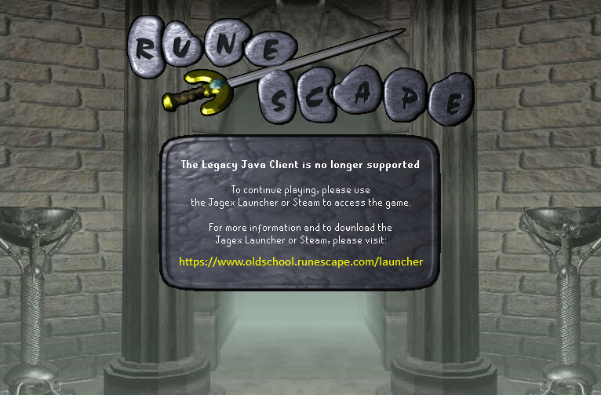

# OldSchool RuneScape Gamepacks

**February 22, 2013 - January 28, 2026**

After nearly 13 years, the little applet that could... couldn't anymore.

---

On the morning of January 28, 2026, at 6:42 AM EST, Jagex quietly replaced the OSRS gamepack with a single JAR file that displays this image:



## What's Here

This repository archived **228 gamepacks** over **193,851 commits**, capturing every gamepack update from OSRS beta till the end of support.

```
gamepacks/      228 JARs, revisions 1-235 (and one that's just an image)
jav_configs/    51 launch configurations
world_list/     The final server list
```

## The Final JAR

The file `osrs--1.jar` isn't actually revision -1. There is no revision. The [gamepack downloader](https://github.com/runetech/osrs-gamepack-downloader) just returned -1 because Jagex shipped a JAR that does nothing but show a farewell image.

The farewell image is base64 encoded directly into `Base64ImageStore.class` - the entire JAR is just 9 files and a goodbye.

## Timeline

*Dates reflect when Jagex compiled each JAR, not when they were pushed live.*

| Date | Milestone |
|------|-----------|
| Feb 22, 2013 | First gamepack built: `osrs-1.jar` |
| Oct 20, 2025 | Final real gamepack built: `osrs-235.jar` |
| Dec 2, 2025 | Farewell JAR compiled |
| Jan 28, 2026 | Farewell JAR pushed live, Legacy Java Client discontinued |

## Links

- [osrs-gamepack-downloader](https://github.com/runetech/osrs-gamepack-downloader) - The tool that made this archive possible

## Legal

All gamepacks are the property of Jagex Ltd. This repository exists for historical preservation.

---

*Thanks for the memories, old friend.*
